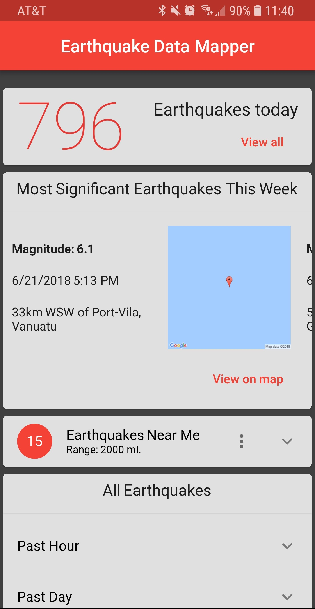
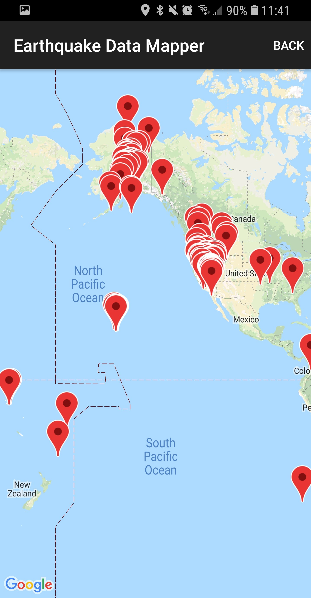
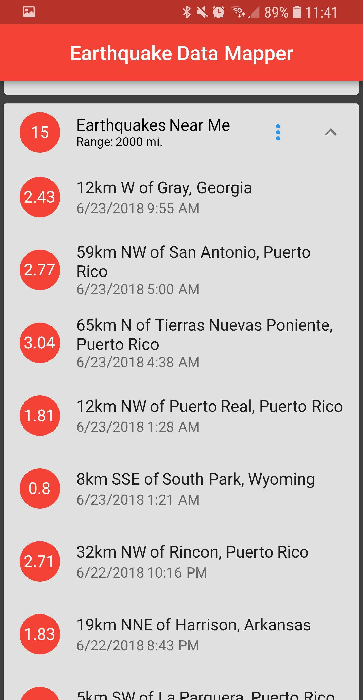
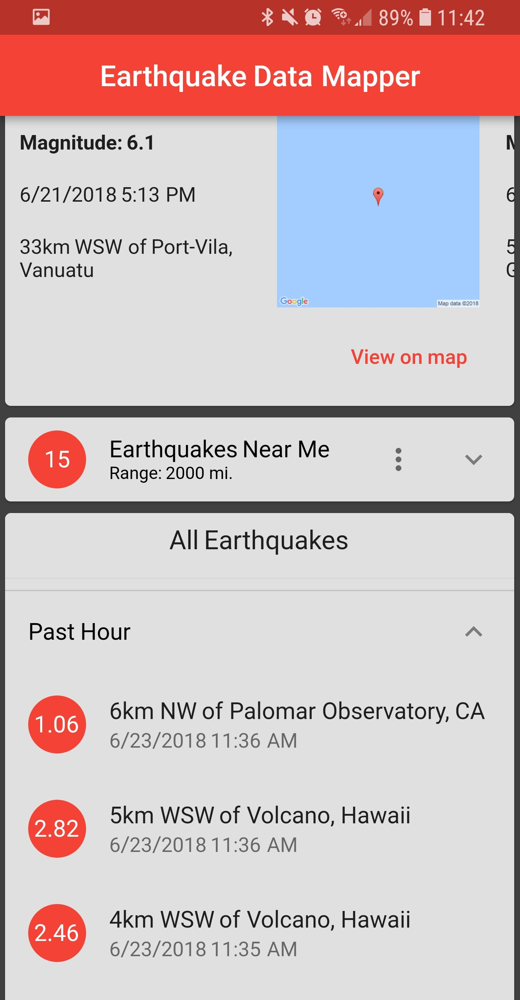
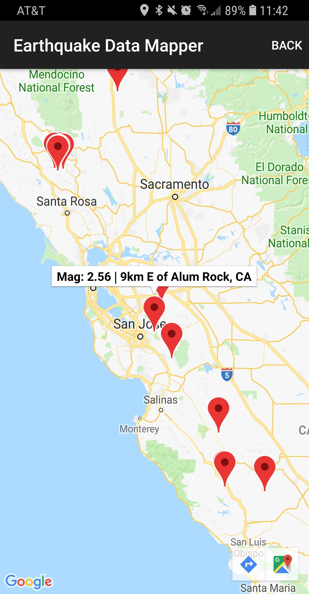

# Earthquake Data Mapper

    
  

# Description

Earthquake Data Mapper allows you to keep track of current earthquakes. 

You can see a map of all of the earthquakes that happened today around the globe, and see earthquakes that occurred near you!

Become aware of the significant earthquakes happening around the world.

# Features:

A map view filled with markers of all of the earthquakes that occurred today.

A scrolling list of the significant earthquakes of the past week.

A list of the earthquakes that happened near your current location - with a customizable range setting. 

A list of all of the earthquakes around the world from the past hour, day, and week.

Each earthquake listing is clickable to show its location on the map.

Internet connection and location services are required for Earthquake Data Mapper to provide its full potential.

Earthquake Data Mapper is 100% free with no ads or in-app purchases!!!

# What's to come:

Push notifications to be notified of new earthquakes - settings will be customizable.

A settings page - for a customizable user experience.

An about page

# More Screenshots

App icon made by Freepik from www.flaticon.com
